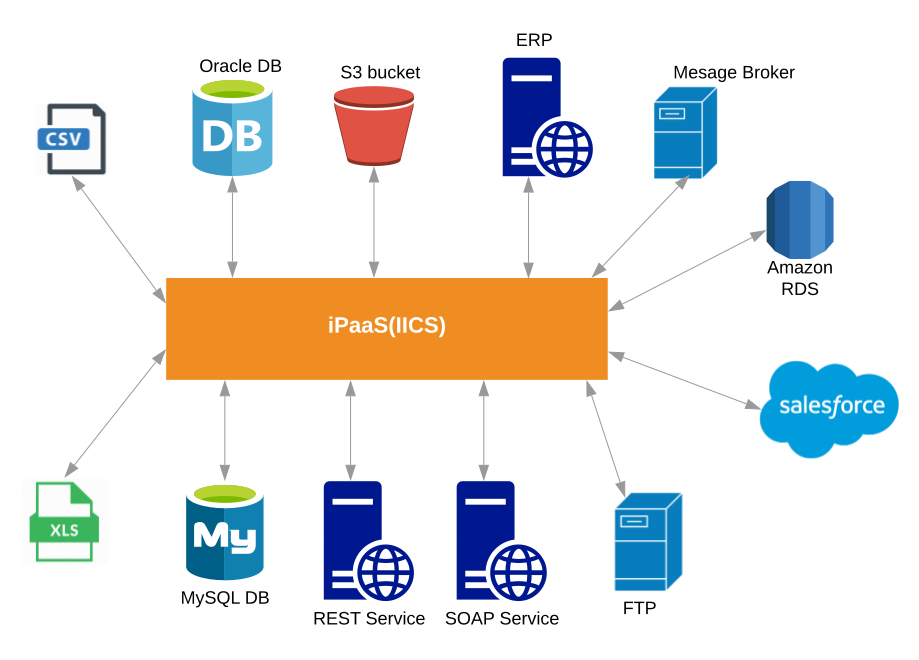

# Informatica Integration Cloud Services
Informatica Intelligent Cloud Services (IICS) is a platform that enables data integration between systems and 
applications, including on-premise-to-cloud, cloud-to-cloud, and cloud-to-on-premise.  IICS belongs to a class of 
products called “Integration Platform as a Service” (iPaaS).

Here are some examples of where IICS can be used:
* Syncing data from PersonHub to a third-party cloud service on a nightly basis.
* Processing changes from CAOS in real time to update an on-premises system.
* Extracting data from a third-party cloud service to populate a reporting database.

The platform caters to a diverse technical audience including those who may have very little integration experience and 
to those who have advanced development and integration skills.

## Benefits
* Create integrations that move data in real time or on a scheduled basis.
* Pre-built connectors enable reusable integrations to a variety of other services (e.g. Salesforce, Oracle, AWS S3).
* Allows integration of on-premises systems, databases, and cloud-based software as a service (SaaS).
* Design and implement integrations in a web browser using no-code and low-code tools. 
* Run integrations in the cloud or deploy them to your own infrastructure.

The below diagram visualizes some of the iPaaS (IICS) capabilities.

The diagram source can be found [here](https://www.lucidchart.com/documents/edit/dd614f97-9c7b-4164-8bd7-f9fac442c4c6/0_0).

## Documentation

This GitLab repository is used as our temporary documentation library for DoIT's offering of Informatica Intelligent Cloud Services (IICS) as part of the first "minimum viable product" (MVP) release.
For more information on the first release, [please see this blog post](./blog-posts/iics-mvp.md).
Feel free to navigate this repository by browsing the files or using the links below.

Please contact us (doit-integration-platform@office365.wisc.edu) if you need additional help or if you weren't able to use the documentation to answer your question.
Merge requests are welcome if you have suggestions for improving the documentation, but please send us an email if you prefer communicating directly.

IICS is part of the infrastructure and services being delivered by the [Interoperability Initiative](https://interop.it.wisc.edu/).

## Adding New Content
Use [template.md](./template.md) to create new content.

## Contents
* [On-Boarding to IICS](./docs/on-boarding-to-iics.md)
* [Logging in](./docs/logging-in.md)
* [Tutorials](./docs/tutorials.md)
* [How To Guides](./docs/howto.md)
* [Training](./docs/training.md)
* [Best Practices And Recommendations](./docs/best-practices.md)
* [Shared Orgs and Sub Orgs](./docs/shared-org-vs-sub-org.md)