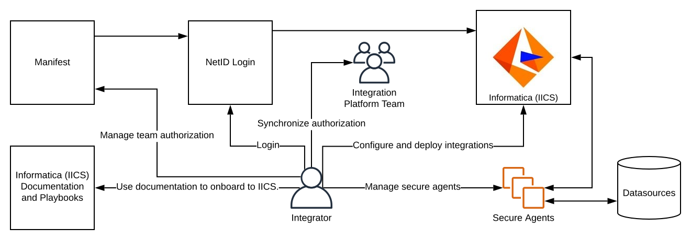

# Informatica Intelligent Cloud Services (IICS) Minimum Viable Product (MVP)

2020-06-24

The DoIT Integration Platform team is working on the first release of IICS for UW-Madison.
The goal of the first release is to be able to onboard new users to IICS.
While IICS is a vended product, the first release is meant to supplement the software with documentation, processes, and playbooks that help scale the service to the UW-Madison integration community.

The first release is meant to cover the areas that make IICS minimally viable to the university.
We work iteratively to allow integrators to use IICS sooner. By segmenting our work into releases, we are able to start providing value without implementing all the capabilities that we want to make available longer-term.

As we approach the completion of the first release, it's important to share what is - and is not - included in the first release.

Visual of what the first release means from a user's perspective:

[Diagram source](https://app.lucidchart.com/invitations/accept/40234605-0d5e-48ce-b50c-6899de233aac)

First release: Be able to onboard a new user to IICS.

- Document on-boarding process, including pathways to online training.
- Curate key Informatica documentation.
- Document process and guidance for deploying and migrating IICS assets.
- Document guidance for managing secure agents.
- Create Docker image for deploying a secure agent.
- Document process involved for provisioning users. 
- Migrate existing accounts to use Manifest and NetID login.
- Create playbooks and tutorials for IICS projects that the Integration Platform team has worked on internally.

Future release(s):

- Automate user provisioning and deprovisioning processes.
- Publish documentation in a more permanent location (outside of GitLab).
- Provide options for managed secure agents so that users don't have to maintain them.
- Document billing model for purchasing additional secure agents and org licenses.