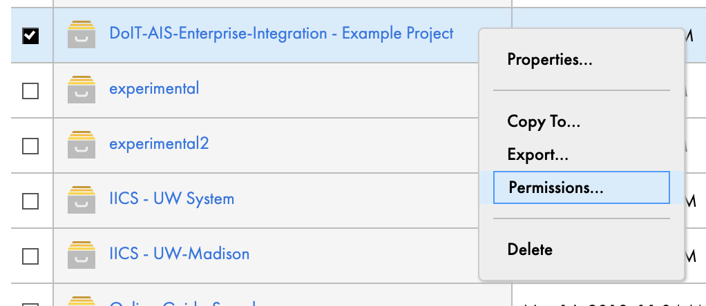
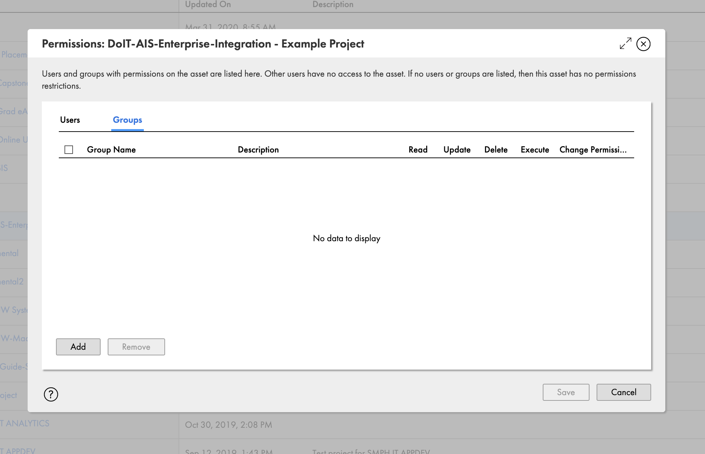
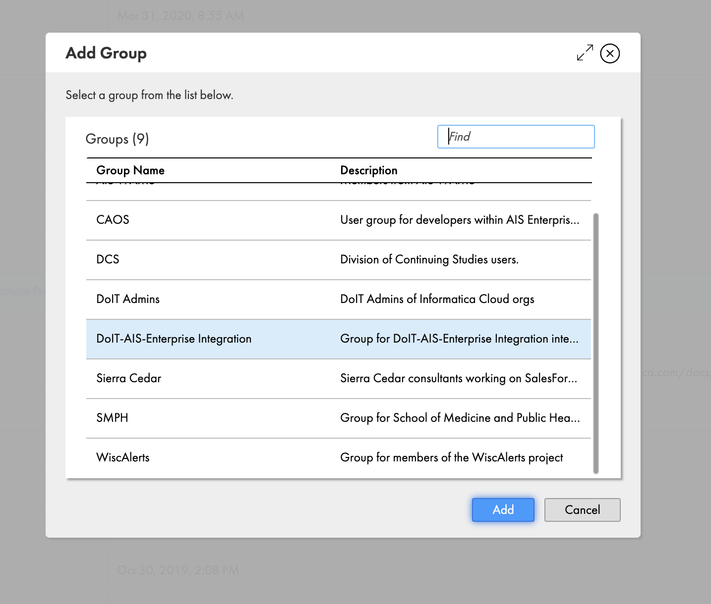
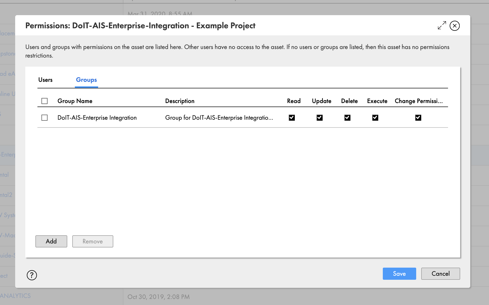

# Best Practices

Here are some recommended best practices for designing integrations in IICS.

## Working In a Shared Environment

UW-Madison operates under a single shared IICS org for each environment (test and production).
This means that you might see other objects in IICS, such as projects, connections, and schedules, that belong to other areas of the university.

### Use User Groups to Control Access

When you create a new project, make sure you edit the permissions to limit who can view and change the assets within the project.
**If no permissions are configured on a project or the assets within it, anybody who has access to IICS will be able to view, change, run, and delete the contents of the project.**
Use the group that was sent when you were granted access to IICS to control who can access the contents of the project.

1. Right-click on a project folder and click "Permissions..." 
1. Click "Add" to add bring up the group selection menu. 
1. Select the group for your team and click "Add". 
1. Click the check boxes for Read, Update, Delete, Execute, and Change Permission. 
1. Click Save.

### Namespace Projects With Your Group Name

Even though you might not have any permissions on a project, you are still able to see that the project exists when exploring all projects.
To help organize the constantly growing list of projects, we recommend that you to prefix your group name before the name of the project: `{group name} - {project name}`

Example: "DoIT-AIS-Enterprise-Integration - Salesforce Integrations"

This structure allows you to search your group name in the project explorer to only see a list of your group's projects.
You can create subfolders within a project if further organization/hierarchy is needed.

Your group name was sent when you were granted access to IICS and you can find the name of your group by editing the permissions for a project.