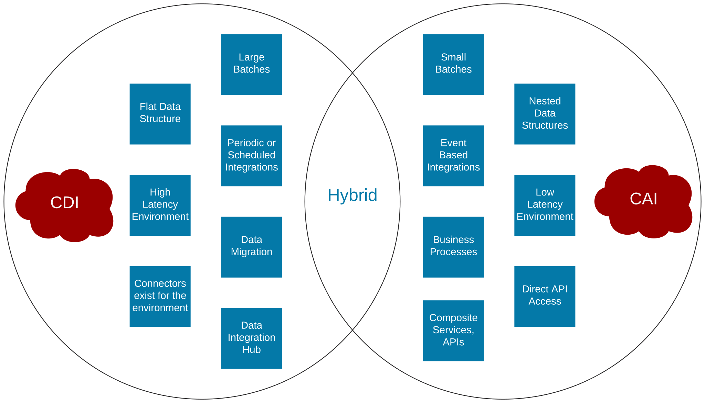

# Cloud Data Integration (CDI) and Cloud Application Integration (CAI)

The diagram source can be found [here](https://app.lucidchart.com/documents/edit/5ab81deb-0dd1-4ca4-9f8b-f1fa2706ec79/0_0).

CDI and CAI are IICS services that are used for integration projects. Depending on the integration criteria, projects can be built using either CDI or CAI, or a hybrid approach when it would be beneficial to an individual project. 

## Cloud Data Integration

Cloud Data Integration (CDI) is IICS's data integration service that allows you to create, schedule, and monitor tasks. It provides a variety of connectors to various data sources and provides mechanisms to transform and map data from source to target.

CDI is best used for projects that have the following characteristics:

- Large batch jobs, i.e. nightly uploads
- Flat data structure
- High latency environment
- Periodic or scheduled jobs
- Connectors exists for environment
- Data migration
- Data Integration Hub

## Cloud Application Integration

Cloud Application Integration (CAI) is IICS's event-driven and service-oriented application integration service. It provides capabilities such as event processing, service orchestration, and process management.

CAI is best used for projects that have the following characteristics:

- Small batch jobs, i.e. single record updates
- Nested data structures, i.e. JSON, XML
- Low latency environment
- Event based / Real time integrations
- Direct access to APIs
- Business Processes
- Composite Services, APIs