# Using Box Connector For Flat Files
[Box](https://uwmadison.app.box.com/) is a secured storage service offered by UW-Madison that can be used to store documents securely.

This tutorial walks through setting up the Box connector for moving a file from a source folder to a destination folder in Box. 
The below diagram describes the scenario. In this scenario, `employee.csv` CSV file from the source folder is copied 
to a target CSV file called, `employee.csv` inside a target folder. Note that any other type of connection (such as S3, database etc.) can be 
used interchangeably with the Box connector.

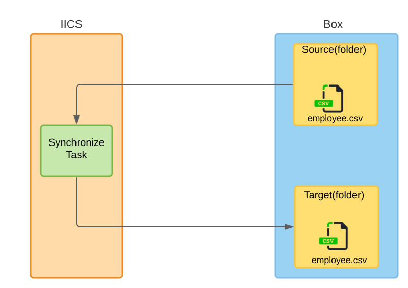

The diagram source can be found [here](https://app.lucidchart.com/documents/edit/77f36467-4d01-4ed8-802a-c2ec3d97738e/0_0?beaconFlowId=26DFD7EF970567C0).

## Box Set Up
* Create two [Box](https://uwmadison.app.box.com/) folders, one as `source` folder and the other as the `target` folder.
* `source` folder contains the file `employee.csv`.

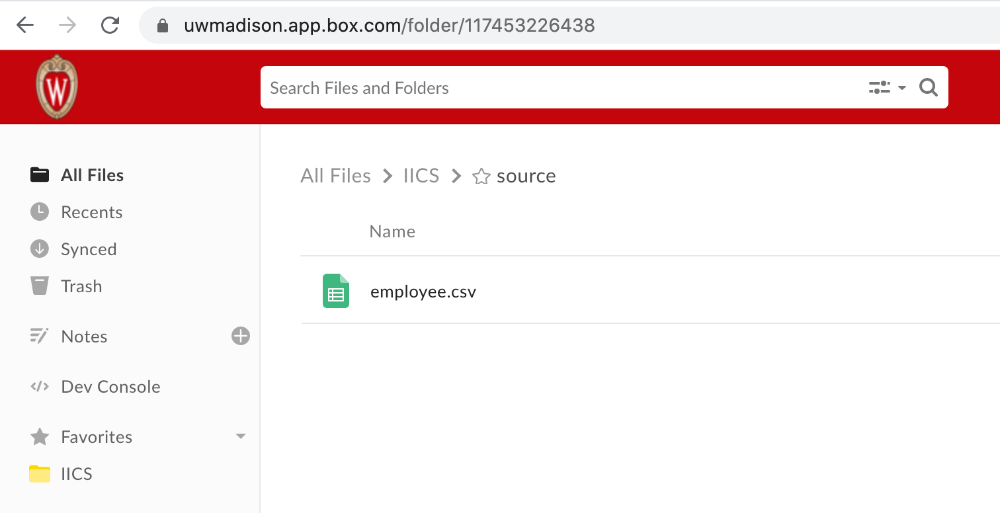

* `employee.csv` file looks like below. 
```
FN, LN, Address, City, State, Zip
John,Doe,120 jefferson st.,Riverside, NJ, 08075
Jack,McGinnis,220 hobo Av.,Phila, PA,09119
Stephen,Tyler,"7452 Terrace ""At the Plaza"" road",SomeTown,SD, 91234
```
* `target` folder contains the file `employee.csv`. It just contains the header row. The Synchronization task will
populate the `employee.csv` file from source folder.
 
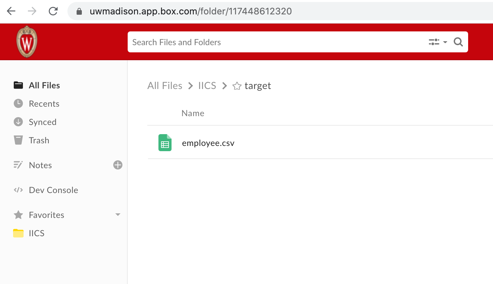

* Content looks like below (only contains the header of the CSV).
```
FN, LN, Address, City, State, Zip
```
* `employee.csv` in target folder contains only header so that IICS can map source file header to target file header.

## IICS Set Up
### Box Source Connector
* Login to IICS.
* Choose Administrator in the top menu dropdown.
* Choose Connections in the left menu.
* Click on the New Connection button towards the top right of the window. This connection will fetch the `employee.csv` file 
from `source` folder (see scenario diagram).

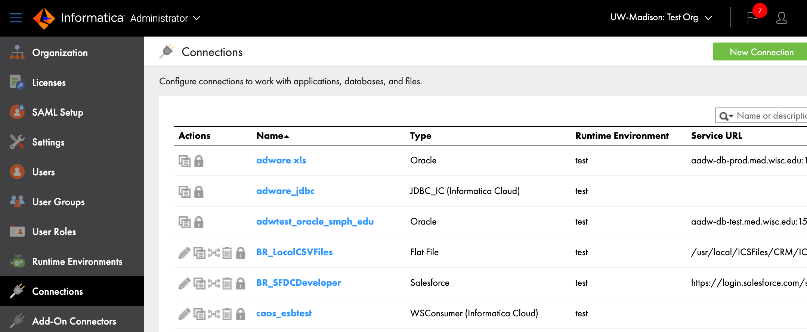

* Select `Box` connector type for a Box connection. Fill `Connection Details`. 
* For `OAuth Access Token:` click the `Get Token` button, and a pop will be appeared for you to authenticate with Box.
* For `URI Request Parameters:` provide `query=employee.csv`. This helps Box connector to narrow down the search for given file. 
See reference at the end for more details.
* Inside Box select `employee.csv` file in each of `source` and `target` folder to get `Box File ID` value.
* After configuring a connection, save it and then click on the Test Connection button to verify that your connection works.

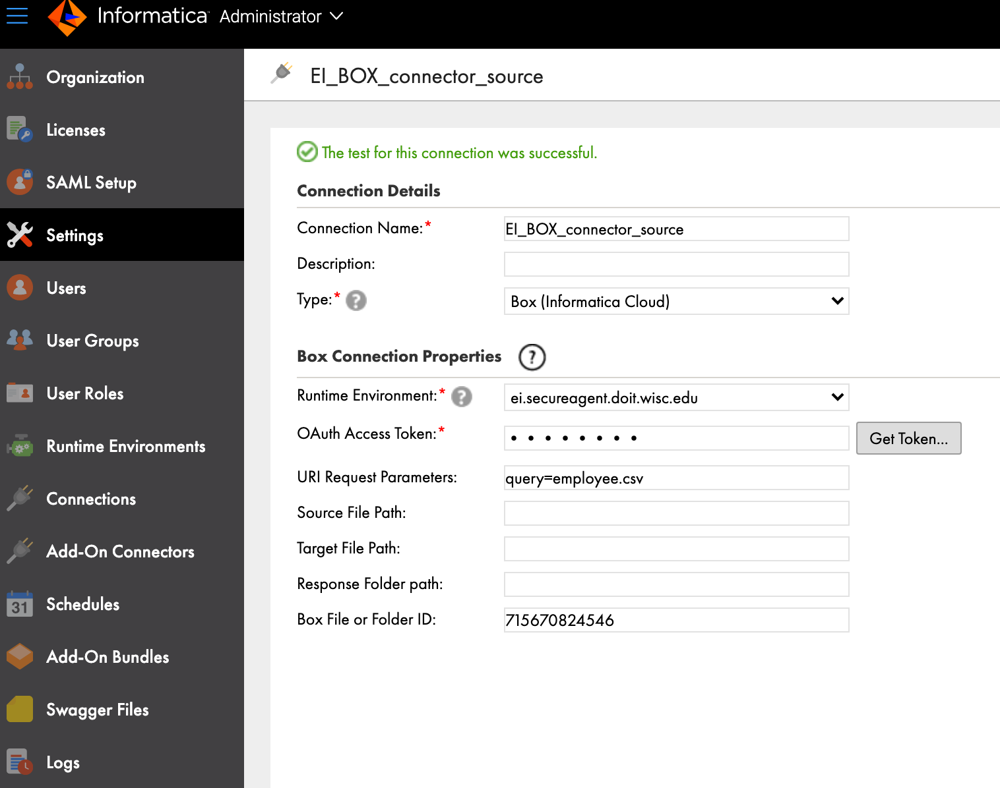

### Box Target Connector
* Repeat above steps and add a second `Box` connection. This connection will update the `employee.csv` file in `target`
folder (see scenario diagram).
* As noted before this also can be a replaced by any other type of connection (e.g. database, AWS S3 etc).

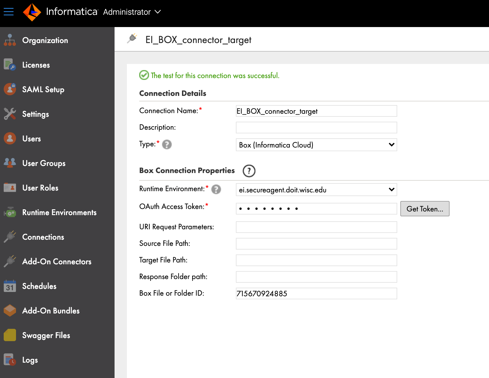


### Synchronization Task
* Create a Synchronization Task in Data Integration. Provide a name and select `insert` as the task operation.

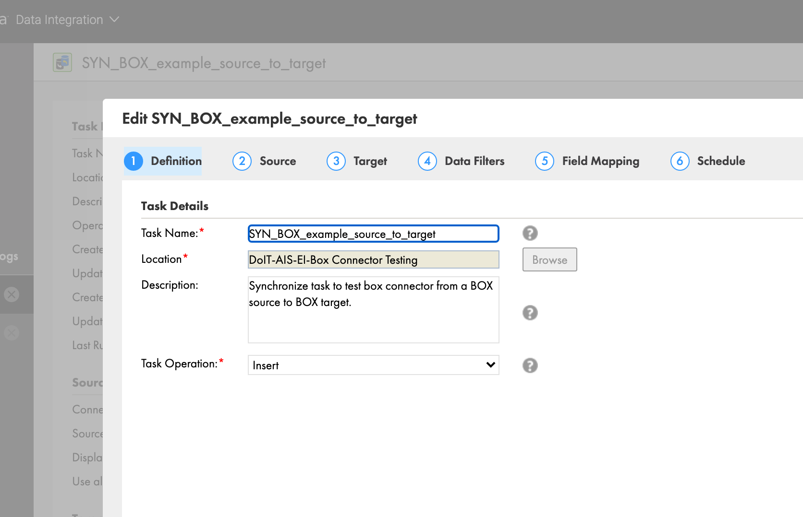

* Provide source information. Select source connection that was defined previously. Select `Single` as the source type. 
Select `employee` as the `Source Object`.
   
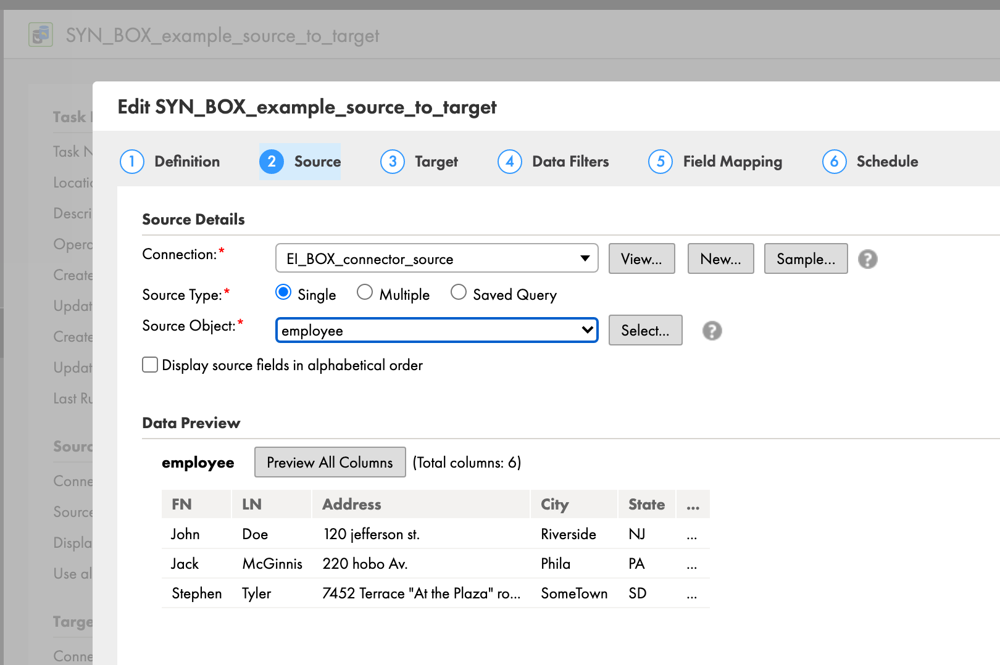  

* Provide target information. Select target connection that was defined previously. Select `employee` as  `Target Object`.

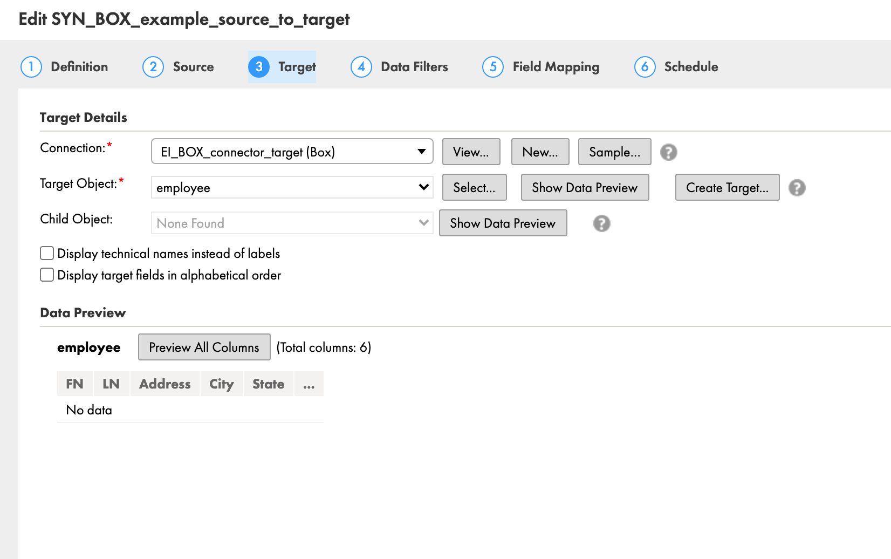   

* Keep the default values for `Data Filters`.

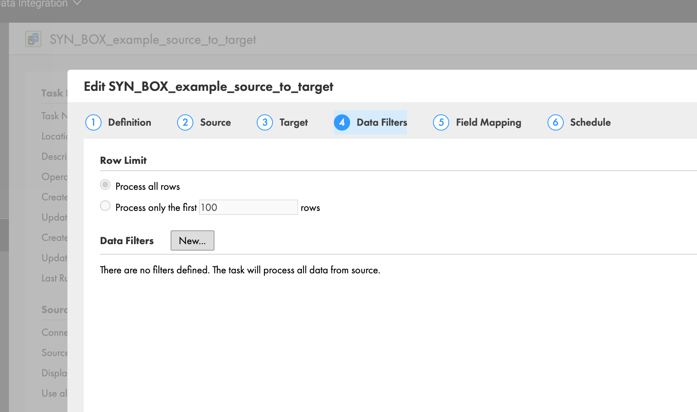 

* Keep the default values for `Field Mappings`.

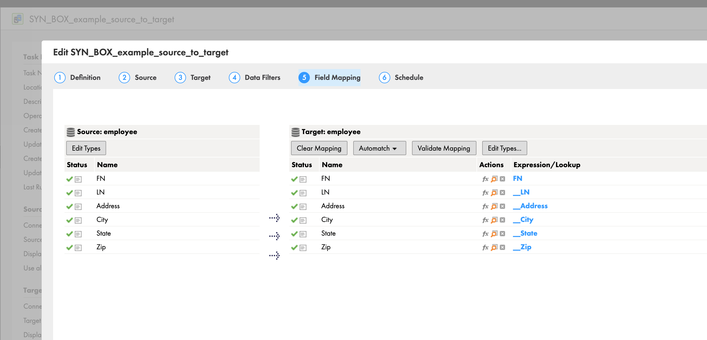 

* Keep the default values for `Schedule`.

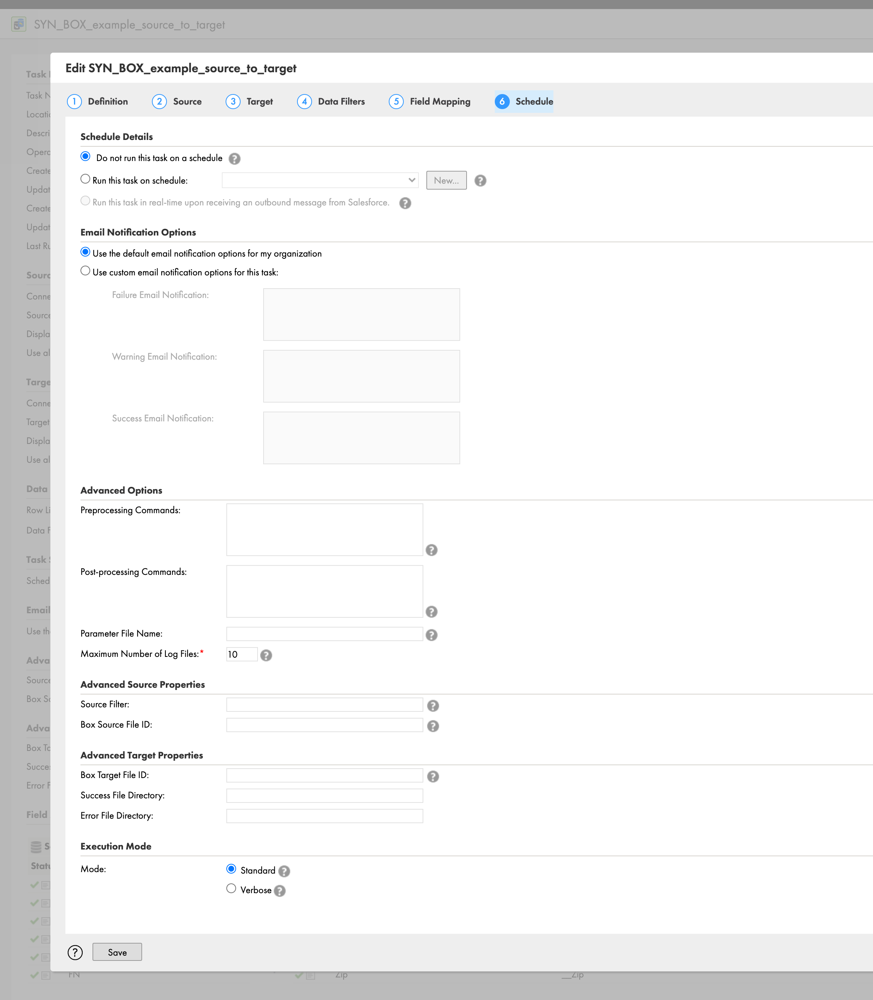 

* Use the `Run` button to execute the Synchronization Task.

After successfully executing the task, `employee.csv` file inside `target` folder will contain the content from `employee.csv` file from source folder.

## Summary
This tutorial walks through how to set up Box connector to copy content from Box source CSV file to a Box target CSV file.   

## References
* UW-Madison Box KB documents
    * https://kb.wisc.edu/box/page.php?id=80045
    * https://kb.wisc.edu/26278
* [Data classification](https://www.wisconsin.edu/uw-policies/uw-system-administrative-policies/information-security-data-classification-and-protection/information-security-data-classification/)
* [IICS Box connector documentation](https://docs.informatica.com/es_es/integration-cloud/cloud-data-integration-connectors/current-version/box-connector-guide/introduction-to-box-connector.html)
* [Box search API](https://developer.box.com/reference/get-search/)