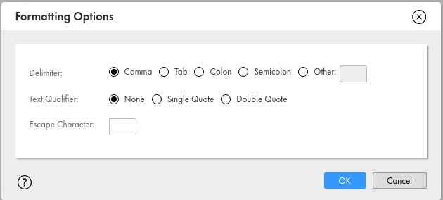
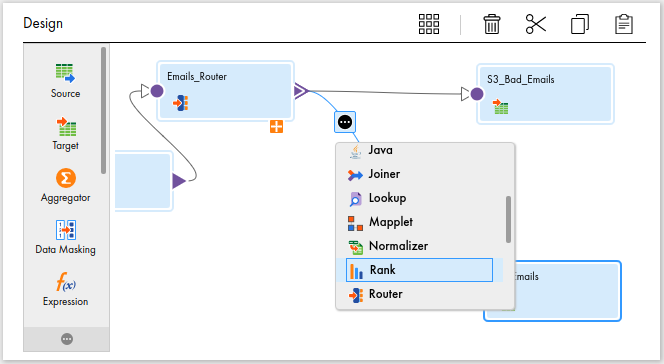
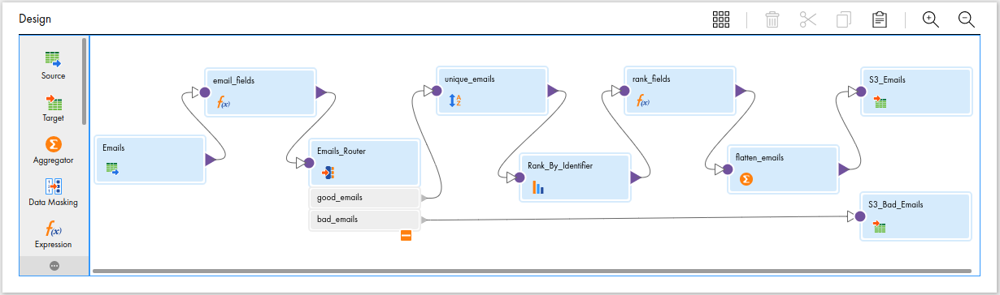

# Wiscalerts Integration

*Please note that some images have been cropped in this tutorial for brevity, so the screenshots may not appear exactly as you see them in IICS.*

This tutorial demonstrates using Informatica Intelligent Cloud Services (IICS) to populate data from a database to a vendor web application.  Our vendor web application has a bulk import process that reads data from a comma separated values (CSV) file that is copied nightly using secure file transfer protocol (SFTP).  The data consists of names, phone numbers and email addresses.  Let's get started!

## Setting Up Connections to Sources and Targets

First, we need to configure IICS [Connections](https://network.informatica.com/onlinehelp/IICS/prod/admin/en/index.htm#page/ff-cloud-connections/Connectors_and_connections.html) to our source databases and targets.

### Prerequisites

Before setting up connections to sources and targets:

1. Gather connection information for each of your sources and targets.  For databases, you'll need a username, password, host name, port, and database name.
2. Determine which [Secure Agent](https://network.informatica.com/onlinehelp/IICS/prod/admin/en/index.htm#page/cc-cloud-administrator/Secure_Agents.html) you will be using for your integration.  A list of Secure Agents for your organization can be found under _Runtime Environments_ in the _Administrator_ module of IICS.  You may need to consult your IICS administrator for guidance.
3. Verify that your Secure Agent has network connectivity to your various connections, including any firewall rules that may need to be configured.
4. Determine which connectors you will need.  For example, you may need a specific database connector (e.g. Oracle, MySQL, PostgreSQL) or you may want to use JDBC.  Informatica maintains a [list of connectors](https://www.informatica.com/products/cloud-integration/connectivity/connectors.html) on their website, and you may need to work with your system administrator to verify that the connector you need is available in your environment.  In this example, we'll be using [Oracle](https://network.informatica.com/onlinehelp/IICS/prod/CDI/en/index.htm#page/ff-cloud-connections/Oracle_connection_properties.html) and [Amazon S3](https://network.informatica.com/onlinehelp/IICS/prod/CDI/en/index.htm#page/data-integration-amazon-s3-connector/Introduction_to_Amazon_S3_Connector.html) connections.

#### JDBC Connections

If you want to use JDBC connections, you'll need to verify that your database specific JDBC library has been installed in the class path of your IICS module (e.g. Data Integrations) on the Secure Agent you will be using.  You'll need to work with your IICS administrator, who can provide you with the path information that you'll need to configure this connection.

### Connections

1. Login to IICS.
2. Choose _Administrator_ in the top menu dropdown.
3. Choose _Connections_ in the left menu.
4. Click on the _New Connection_ button towards the top right of the window.


5. Enter a connection name and description and choose a connection type.  After you have choosen a connection type, the screen will refresh with the options for the connector.  Pay attention to the required fields marked by an asterix.  Some connectors have a large number of options, many of which are not required.


6. After configuring a connection, save it and then click on the _Test Connection_ button to verify that your connection works.

In this scenario, we created two different database connections to our source systems using the Oracle connector, one Amazon S3 connection for logging and debugging files, and an SFTP connection to our target system.

## Data Integration

After verifying your connections, you are ready to begin creating your integration!

### Project Folder

1. Choose _Data Integration_ in the top menu dropdown.
2. Choose _Explore_ in the left menu.
3. Click on the _New Project_ button towards the top right of the window.


4. Give your project a name and description, then click the _Save_ button.


### Set Project Permissions

IICS permissions are based on folder level permissions, and best practice is to assign permissions based on a group.  If you need a group created, please contact doit-integration-platform@office365.wisc.edu.

1. Find your project under the _All Projects_ list.
2. Right click on your project and choose _Permissions..._.
3. Click the _Groups_ tab, and click the _Add_ button.
4. Find your group using the groups browser, select it, and then click the _Add_ button.
5. Check the appropriate permissions boxes (e.g. Read, Update, Delete, Execute,...) and click _Save_.

### Mapping

The main work of an IICS data integration is accomplished in a [Mapping](https://network.informatica.com/onlinehelp/IICS/prod/CDI/en/index.htm#page/hh-cloud-mappings/Mappings.html).  We'll be creating one mapping with many [Tranformations](https://network.informatica.com/onlinehelp/IICS/prod/CDI/en/index.htm#page/jj-cloud-transformations/Transformations.html) to get the data from our sources, make changes to the data, and put our new data in our target system.

#### Emails

Let's take emails from our source database and put them in a CSV file in Amazon S3!

1. Open your project folder by clicking on _Explore_ in the Data Integration module of IICS.
2. Click on the green plus sign next to _New..._ in the top left corner of the window; the new asset window will open.
3. Click on _Mappings_ on the left hand menu, choose _Mapping_, then _Create_.


IICS will create a basic mapping with a [Source](https://network.informatica.com/onlinehelp/IICS/prod/CDI/en/index.htm#page/jj-cloud-transformations/Source_transformation.html) and a [Target](https://network.informatica.com/onlinehelp/IICS/prod/CDI/en/index.htm#page/jj-cloud-transformations/Target_transformation.html).


##### Email Source

After adding the basic mapping, let's edit our source to get emails.

1. Click on the _Source_ box and give your source a name and description.


2. Next, click on the _Source_ left menu item and choose your connection in the _Connection_ drop down.  Next, click the _Select_ box to choose which object you want to use.  In this case, it is a database view called _WISCALERT_EMAILS_.


3. Click on the _Fields_ menu option to see what columns are available.  You can delete unnecessary columns or edit column metadata in more advanced situations, but in our case, we'll leave everything as it is.


Some data sources support [partitioning](https://network.informatica.com/onlinehelp/IICS/prod/CDI/en/index.htm#page/jj-cloud-transformations/Partitions.html), which optimize performance for larger data sets.  In our case, we don't need to configure this.

##### Email Target

Now, let's edit the target.

1. Next, click on the _Target_ box and give your target a name and description in the _General_ settings.


2. In the _Target_ settings, click on the _Connection_ dropdown and choose your AWS S3 connection.
3. Then click on the _Select_ button in the _Object_ field.


4. A _Target Object_ window will open.
5. Click the radio button _Create New at Runtime_ and enter a filename, _all_emails.csv_.


6. Optionally, click on the _Formatting Objects_ button to open a window with _Formatting Settings_ for your new file, including delimiter, text quoting, and escape characters.



7. Review the _Target Fields_ and _Field Mapping_ properties.  Because we are are creating a new file, we can't make changes to these settings, since the S3 connector will create a file with all of the fields that have been passed to this transformation.  Alternatively, you can upload a CSV file with column headers to your S3 target bucket, which will allow you to map fields to your file columns.

8.  Click the _Save_ button in the top right of the window.  During the save process, IICS will attempt to validate your mapping.  If it successfully validates your mapping, you will see a notification popup "Mapping was saved successfully".  After closing the popup, the status will have changed from _Invalid_ to _Valid_ in the mapping header, and the _Run_ button turn green and be available.  If IICS detects an error, you will be presented with a _Validation_ sidebar with errors that need to be fixed.  Fix the errors and click _Save_ to revalidate.


Congratulations!  You have successfully created your first mapping!

#### Run the Mapping

1. You can run the mapping directly from the mapping editor by clicking on the green _Run_ button in the top right corner.  Alternatively, you can run your mapping from the _Explore_ view by right clicking on your mapping and choosing _Run_.
2. A _Run_ dialog box will appear.  Choose the correct runtime environment for your mapping.  *Make sure you choose the correct runtime environment, because not every runtime environment will be available to you or be able to access your sources and targets.*
3. Click on the _Run_ button.


4. Click on _My Jobs_ in the left menu bar.
5. A list of your jobs will appear.  While a job is running you may see an _Updates Available_ prompt, letting you know that you can refresh the screen for updated information, or you can click on the _Refresh_ circular icon in the top right of the window.  After your job has finished, the _End Time_ column will be populated, and then you can examine the file in your S3 bucket to see that it was populated with all of the emails from your source system!


#### Email Validation

At this point, we have identifiers and emails being copied from our source to our target system.  However, as part of our [ETL](https://en.wikipedia.org/wiki/Extract,_transform,_load) process, we'd like to validate that the email addresses are in the [correct format](https://en.wikipedia.org/wiki/Email_address), _localaddress@domain_, and has the correct characters for each part of the address.  If one of our email addresses doesn't match, we will send it to a different S3 file that we can use for debugging and alerting purposes.

In order to accomplish this, we will be using an [Expression](https://network.informatica.com/onlinehelp/IICS/prod/CDI/en/index.htm#page/jj-cloud-transformations/Expression_transformation.html) transformation that will set a variable for each email address and a [Router](https://network.informatica.com/onlinehelp/IICS/prod/CDI/en/index.htm#page/jj-cloud-transformations/Router_transformation.html) transformation to copy bad emails to one file and good emails to another file.

Let's get started!

1. Open your mapping.
2. Highlight the link between the source and target boxes in the designer; a circle with three dots will appear.  Click on the circle with three dots and then click on _Expression_.


3. Give your Expression transformation a name and description.


4. Optionally, review and edit the incoming fields in the _Incoming Fields_ left menu.
5. Click on the _Expression_ item in the left menu, then click on the encircled plus sign.

The first new field that we will be adding is a _Variable Field_, a variable that is used internally in this transformation and is not passed to later transformations.  This variable can be used by other fields in this transformation, as long as they are defined after this one.  The order of the fields can be changed later if necessary.

6. Choose _Variable Field_ for _Field Type_, give your field a name, a type, and specify a precision.  In our case, our _trimmed_email_ field is a string with a maximum size of 100 characters.
7. Click _OK_


8. Now that you have created the variable, set its value by clicking on _Configure..._ under the _Expression_ column.


9. This opens the _Field Expression_ window where you can define the value.  Here, we are using
two Informatica functions, _lower_ and _reg_replace_, to remove whitespace from our email addresses.  Many of the Informatica functions are based on similar SQL functions, although there are some differences, so it is best to refer to the [function reference](https://network.informatica.com/onlinehelp/IICS/prod/CDI/en/index.htm#page/qq-cloud-function-reference/Function_reference.html), which is available online and in the _Field Expression_ window by clicking on the dropdown _Fields_ and choosing _Built-in functions_.


10. Create two new variables, _new_email_ and _valid_email_.  Unlike _trimmed_email_, both of these are _Output Fields_, which means they will passed to subsequent transformations in the mapping.  Field _new_email_ should be of _string_ type with a precision of _100_ and _valid_email_ should be set to type _integer_.  Integer values stand in for boolean types in IICS, with FALSE being equivalent to 0 and TRUE being any non-zero integer value.

11. Edit the field expressions for each of these variables.  The [expression](https://network.informatica.com/onlinehelp/IICS/prod/CDI/en/index.htm#page/ll-cloud-tasks/Field_expressions.html) for _new_email_ is set to the variable field _trimmed_email_, so it can be used in later transformations.  We also use _trimmed_email_ in the expression for _valid_email_, using an IICS built-in function, [reg_match](https://network.informatica.com/onlinehelp/IICS/prod/CDI/en/index.htm#page/qq-cloud-function-reference/REG_MATCH.html), to compare our _trimmed_email_ variable to a Perl regular expression for a correctly formatted email address and return a boolean value.


##### Routing

In this step, we will use the value of _valid_email_ with a [Router](https://network.informatica.com/onlinehelp/IICS/prod/CDI/en/index.htm#page/jj-cloud-transformations/Router_transformation.html) transformation that will send correctly formatted email addresses to our _S3_Emails_ target and incorrectly formatted emails to a new target called _S3_Bad_Emails_.

1. Return to the designer and hover the arrow connecting _email_fields_ and _S3_Emails_, and then click on the circle with three dots.
2. Scroll down and click on _Router_ to add a [Router transformation](https://network.informatica.com/onlinehelp/IICS/prod/CDI/en/index.htm#page/jj-cloud-transformations/Router_transformation.html) to your mapping.


3. Give the transformation a name and a description.


4. Click on _Incoming Fields_ in the left menu to review the fields that are passed to the router.  Note that the _valid_email_ and _new_email_ output fields are available from our expression transformation.


5. Click on _Output Groups_ in the left menu.  Here you can define _Output Groups_ with conditions.  The _DEFAULT1_ output group is a catch all for rows that do not match any of the other output group conditions.  In our case, we are going to base our output groups on the _valid_email_ output field.
6. In the designer, click on the orange plus sign under _Emails_Router_ to see the connection between the router and the target.
7. Click on _DEFAULT1_ and change the name to _good_emails_.
8. Click on _Configure..._ under the _Condition Header_.


9. In the Condition popup, choose _Advanced_, then click on the _Define Filter Condition_ button.


10. Highlight _valid_email_, and click _Add_ to add the Output Field to the _Filter Condition_.  Because this is a boolean variable, we do not need to do anything else.  The output from the _Filter Condition_ should be a boolean value, so in other cases you may need to use a built-in function to evaluate other data types.
11. Click the _OK_ button to close the advanced filter editor, and then click _OK_ again to close the _Edit Filter Condition_ window.
12. In the _Output Groups_ window, click on the encircled plus sign on the right hand side to add another output group.


13. Repeating steps 6 through 10, add an Output Group named bad_emails with an advanced filter condition of `NOT valid email`.  Notice that in the designer window, there is no line from  _bad_emails_, unlike the line from _good_emails_ to _S3_Emails_.


14. Drag a new _Target_ transformation to the space to the right of the _Emails Router_ transformation.


15. Connect the arrow to the right of _bad_emails_ to the dot on the left of your new target object.
16. Repeat the steps above to configure your new _Target_ transformation, calling it _S3_Bad_Emails_.
17. Save and run your mapping.

At this point, our mapping successfully reads identifiers and emails from our source, checks that they pass a regular expression, and routes them two two different CSV files.  Congratulations!

#### S3 Targets

We have found S3 to be an excellent place to store targets and lookup objects with excellent performance and easy accessibility.  For example, S3 is an excellent option for when you do not have easy access to the Secure Agent filesystem.  You may want to manually create or use [Terraform](https://terraform.io) or another [infrastructure as code](https://en.wikipedia.org/wiki/Infrastructure_as_code) tool to create your target objects in S3 before you work on your mapping.  This will allow you to map the fields directly.  The only thing you need to create is a CSV file with header information, e.g. `ID,EMAIL_ADDRESS`, and then you will be able to map IICS fields to your file.

One issue that we have run into using the S3 connector is instances where your target file should not have a header row.  Targets created with the IICS [Flat File connection](https://network.informatica.com/onlinehelp/IICS/prod/admin/en/index.htm#page/ff-cloud-connections/Flat_file_connections.html) have an option for not including the header row, where targets created using the S3 connector do not.

#### Flattening Emails

Now that we have completed a basic mapping, let's add more complexity.  Currently, we have a one to one row mapping from our source to our target.  However, the vendor web application expects an identifier with up to three email addresses, so our target needs to be a CSV file with these headers: `ID,EMAIL1,EMAIL2,EMAIL3`.

We can handle this criteria using a common SQL technique of assigning a row number and counter to our source rows and then using an aggregate function to group and flatten the rows into columns.

##### Adding Rank

1. Begin by selecting the arrow between _Emails_Router_ and _S3_Emails_, then clicking the three dots and choosing a [Rank](https://network.informatica.com/onlinehelp/IICS/prod/CDI/en/index.htm#page/jj-cloud-transformations/Rank_transformation.html) transformation, which is an equivalent concept to rank functions found in SQL databases.



2. Give the rank transformation a name, _Rank_By_Identifier_ and description.
3. In the _Incoming Fields_ left menu option, choose _Named Fields_ under "Field Selection Criteria", and then click on _Configure..._ and choose PVI and new_email.

**Limiting the incoming fields using Named Fields is a common technique that prevents naming collisions and reduces the amount of data that is transferred to subsequent transformations.**

4. In the _Rank_ left menu item, choose _new_email_ in the _Rank By_ dropdown.
5. A valid _Number of Rows_ is also required.  This will limit the number of rows that are ranked for each _Group By_ column.  Let's enter 100 here, even though it is very unlikely that one person would have 100 email addresses!


6. In the _Group By_ options, click the encircled plus sign to add a field, then choose _PVI_ in the drop down menu.  This is equivalent in function to a SQL group by clause.


##### Adding Rank Expressions

Now that we've added a rank to each row, let's calculate a row number by adding an expression transformation after our rank tranformation.

1. Click on the arrow, and choose _Expression_.
2. In the _Incoming Fields_, note that there is a new field named _RANKINDEX_ which has been added by the rank tranformation.  We will use this field to determine our row number.


3. Create an integer output field named _output_row_.  The expression for _output_row_ should be set to `trunc(rankindex/3,0)`.  This will divide the rankindex value by three, the number of email columns we need in our target, and throw away the remainder, giving us a row number for each value of our identifier, PVI.
4. Create an integer output field named _output_order_ with an expression of `iif(rankindex>3,mod(rankindex,3),rankindex)`.  This is our first use of [IIF](https://network.informatica.com/onlinehelp/IICS/prod/CDI/en/index.htm#page/qq-cloud-function-reference/IIF.html), the IICS conditional function, which is used frequently in tranformations.  Here we are using it to give us the remainder of the RANKINDEX divided by three, which will give us the rank of the row with regards to the new output row.  For example if our _RANKINDEX_ is 7, the _output_order_, _**1**_, will be calculated by using integer division represented by the equation _7 ÷ 3 = 2 r **1**_.


Here's how our data might look after our expression tranformation:

| PVI | EMAIL | RANKINDEX | output_row | output_order |
| --- | ----- | --------- | ---------- | ------------ |
| A11 | eric@example.com  | 1 | 0 | 1 |
| A11 | eric2@example.com  | 2 | 0 | 2 |
| A11 | eric3@example.com  | 3 | 0 | 3 |
| A11 | eric4@example.com  | 4 | 1 | 1 |
| A14 | jenny@example.com  | 1 | 0 | 1 |
| A14 | jenny1@example.com  | 2 | 0 | 2 |
| A14 | jenny2@example.com  | 3 | 0 | 3 |

##### Flattening With An Aggregator Tranformation And Group Function

In order to flatten these values for a CSV file with _ID_, _EMAIL1_, _EMAIL2_, and _EMAIL3_ columns, we can use an [Aggregator](https://network.informatica.com/onlinehelp/IICS/prod/CDI/en/index.htm#page/jj-cloud-transformations/Aggregator_transformation.html) tranformation and the [MAX](https://network.informatica.com/onlinehelp/IICS/prod/CDI/en/index.htm#page/qq-cloud-function-reference/MAX_String.html) function to choose one value for each of these fields.

1. Click on the arrow after our latest expression tranformation, click the three dots, and choose _Aggregator_.
2. Give the aggregator transformation a name and description.
3. In _Incoming Fields_ properties, choose _Named Fields_ and include _PVI_, _new_email_, _output_order_, and _output_row_.


4. In the _Group By_ properties, click the encircled plus sign to add a field, then click the drop down and select _PVI_.  Add another field, then click the drop down and select _output_row_.   We are telling this tranformation that we want to group our rows by these two fields.


5. In the _Aggregate_ properties menu item, add three fields, _email_1_, _email_2_, and _email_3_.  These should be string fields of an appropriate size for email addresses, so we'll use the same value of 100 that we used in prior tranformations.
6. Click _Configure..._ for each of these fields, and assign them the expressions of 	`MAX(IIF(output_order=1,new_email,null))`,`MAX(IIF(output_order=2,new_email,null))`, and `MAX(IIF(output_order=3,new_email,null))`.


Now, if we only choose _PVI_, _output_row_, _EMAIL_1_, _EMAIL_2_, and _EMAIL_3_ fields, our data would look like this:

| PVI | output_row | email_1 | email_2 | email_3 |
| --- | ---------- | ------- | ------- | ------- |
| A11 | 0 | eric@example.com  | eric2@example.com | eric3@example.com |
| A11 | 1 | eric4@example.com |  |  |  |
| A14 | 0 | jenny@example.com | jenny1@example.com | jenny2@example.com |

Using the [MAX](https://network.informatica.com/onlinehelp/IICS/prod/CDI/en/index.htm#page/qq-cloud-function-reference/MAX_String.html) function in this manner is a common way to flatten data in SQL databases, but it doesn't feel intuitive and warrants some additional explanation.
1.  For each PVI, we give each email address a rank.
2.  Because there are three output columns, we can calculate which row an email address will belong to by dividing the rank by three in the expression `trunc(rankindex/3,0)`.
3.  We also rank each item in the set of three by using the `mod(rankindex,3)` function.
4.  Finally, grouping by _PVI_ and _output_row_, we take the maximum value for the combination of _PVI_ and _output_row_, which will either be an email address or null.

##### Updating your target

After you have added the _flatten_emails_ tranformation, you will need to update your target, _S3_Emails_.  Because we are changing the columns, you will need to delete your file in the S3 bucket to create it again at runtime.  Use the _Incoming Fields_ properties on your target to limit the columns that you send to your file, including _PVI_, _output_row_, _email_1_, _email_2_, and _email_3_ fields.

After updating your target, save and run the mapping to see how emails have been flattened into three columns.

#### Unique Values

Looking through our file, we have noticed a problem!  There are a couple of rows that only have emails in the _email_1_ and _email_3_ columns.  Let's see what happened!

In our source, we can see that Clarissa has three email addresses:

| PVI | EMAIL |
| --- | ----- |
| A41 | clarrisa@example.com  |
| A41 | clarrisa2@example.com  |
| A41 | clarissa2@example.com  |

In our _S3_Emails_ file, her row looks like this:

| PVI | OUTPUT_ROW | EMAIL_1 | EMAIL_2 | EMAIL_3 |
| --- | ---------- | --------| ------- | ------- |
| A41 | 0 | clarrisa@example.com  | | clarissa2@example.com |

Why is _email_2_ blank?  If we could look at our data after the _Rank_By_Identifier_ tranformation, we would see that Clarrisa's emails look like this:

| PVI | EMAIL | RANKINDEX | output_row | output_order |
| --- | ----- | --------- | ---------- | ------------ |
| A41 | clarrisa@example.com  | 1 | 0 | 1 |
| A41 | clarrisa2@example.com  | 3 | 0 | 3 |
| A41 | clarissa2@example.com  | 3 | 0 | 3 |

Because Clarissa has two of the same email addresses, they were given the same rank.  These two emails tied for third!

**Tip: Use S3 targets to debug transformations.  You can have more than one target for a tranformation.  Want to see what a transformation is doing?  Add an S3 target and link it to the output of the transformation!**

How could we solve this problem?  The solution is only passing distinct values to the rank transformation.  There are a couple of ways that we could accomplish this.
* In the _Advanced_ properties of our source, we can check the box next to _Select distinct rows only_.  While this would work in our case, it will not work for mix matched case, e.g. clarrisa2@example.com and CLARISSA2@example.com.  It might also cause performance problems with some databases and large data sets.
* Add a [Sorter](https://network.informatica.com/onlinehelp/IICS/prod/CDI/en/index.htm#page/jj-cloud-transformations/Sorter_transformation.html) tranformation before our _Rank_ tranformation.  This tranformation can filter out case-insensitive distinct values and can improve performance of subsequent tranformations, such as [Lookup](https://network.informatica.com/onlinehelp/IICS/prod/CDI/en/index.htm#page/jj-cloud-transformations/Lookup_transformation.html) and [Joiner](https://network.informatica.com/onlinehelp/IICS/prod/CDI/en/index.htm#page/jj-cloud-transformations/Joiner_transformation.html) tranformations.

##### Unique Values With A Sorter Transformation

Let's add a Sorter tranformation!

1. Highlight the arrow between _Emails_Router_ and _Rank_By_Identifier_ and add a Sorter tranformation.  You will need to scroll down on the popup window to find the tranformation.
2. Name the tranformation _unique_emails_ and give it a description.


3. In the _Incoming Fields_ properties, choose _Named Fields_ in the _Field Selection Criteria_, and then click on _Configure..._ to choose _PVI_ and _new_email_.


4. In the _Sort_ properties, click on the encircled plus sign and add two fields to the _Sort Conditions_ table, _PVI_ and _new_email_.


5. In _Advanced_ properties, uncheck _Case Sensitive_ and check _Distinct_.


6. Save and run the mapping.

Fixed!  Clarissa's row looks like this:

| PVI | OUTPUT_ROW | EMAIL_1 | EMAIL_2 | EMAIL_3 |
| --- | ---------- | --------| ------- | ------- |
| A41 | 0 | clarrisa@example.com | clarissa2@example.com |  |

#### Mapplet

After rearranging some of our tranformations, here is how our mapping looks in the designer:



We can see that we have many objects, and it is easy to see that a complicated mapping could be busy and hard to understand.  Often, we may add the same series of tranformations for different sources, further complicating our design.  IICS provides a [Mapplet](https://network.informatica.com/onlinehelp/IICS/prod/CDI/en/index.htm#page/jj-cloud-transformations/Mapplet_transformation.html) tranformation to create reusable sets of tranformations that can help streamline and [DRY](https://en.wikipedia.org/wiki/Don%27t_repeat_yourself) up our mappings.  Let's see how we can use it here.

1. Close the mapping and return to your project folder in the IICS Data Integration module.
2. Click on the _New..._ menu item in the left menu bar and click on _Mapplets_ in the left popup menu.  Then choose "Mapplet" and click the blue _Create_ button.
3. Give your mapplet a name of _flatten_tranformation_ and description.
4. Click on the _Input_ source box in the designer.  Optionally give the input a name and description.
5. Click on the _Input Fields_ properties menu.  Add two string fields of 100 precision called _identifier_ and _value_.
6. Based on our mapping above, add the following transformations between _Input_ and _Output_:
   1. A sorter transformation to sort our input columns by _identifier_.  Make sure the advanced settings include case insensitivy and distinct values.
   2. A rank transformation to rank by _value_ and group by _identifier_.
   3. An expression tranformation to create two fields called _output_row_ and _output_order_ using the functions above, but with identifier and value instead of PVI and email_address.
   4. An aggregator transformation that groups by _identifier_ and _output row_ that creates three aggregate fields, _value_1_, _value_2_, and _value_3_, and which uses _value_ instead of _email_address_ in the aggregate expression.
1. Modify the _Output_ target to only read and output _identifier_, _output_row_, _value_1, _value_2_, and _value_3_ fields.
2. Save your mapplet and make sure it validates.


##### Using Our Mapplet

Now, let's use our mapplet in our Mapping!

1. Close the mapplet and return to your project folder in the IICS Data Integration module.
2. Open your mapping.
3. Using your mouse and holding down the control key, select the four transformations that  will be replaced with your mapplet, _unique_emails_, _Rank_By_Identifier_, _rank_fields_, and _flatten_emails_.
4. Delete the tranformations using the delete key or by clicking on the trashcan icon.
5. Add a mapplet transformation to your design by dragging and dropping the tranformation from the Design menu.
6. Give the mapplet a name, _flatten_emails_, and description.


7. In the Mapplet properties, click on the _Select_ box, and then browse to choose the _flatten_tranformation_ mapplet.


8. Now that you have specified which mapplet you will be using, connect the _good_emails_ output group of _Emails Router_ to the _flatten_emails_ tranformation.
9. Click on the _flatten_emails_ transformation, and then click on the _Incoming Fields_ properties.  Select _Named Fields_ under Field Selection Criteria and choose _PVI_ and _new_email_.
10. In the _Field Mapping_ properties, drag _PVI_ to _identifier_ and _new_email_ to _value_.
11. Connect the output of the tranformation to the _S3_Emails_ target.
12. Update the _S3_Emails_ target.  Instead of creating the target at runtime, update the target transformation to use the existing S3 file, _all_emails.csv_, and then map the new fields to the correct fields in the target.
12. Save, validate, and run your mapping.


As we can see from the image above, using a mapplet transformation significantly simplifies our design.  However, the real power of a mapplet is being able to reuse the mapplet for another source, which is what we will do in the next step, adding phone numbers!

#### Phones

We will be repeating many of the steps above to add phone numbers, but instead of detailing the steps like we did above with emails, we'll list the steps here.

1. In your mapping, add and configure a source for phone numbers.
2. Add a mapplet transformation, using the _flatten tranformation_ mapplet that we created in a previous step.
3. Add an S3 target that will create a new CSV file, _all_phones.csv_.
4. Save and run your mapping.

#### Joining It All Together

We have similar processes taking emails and phones and putting the data in two different CSV files.  Now we need to join these together to create one output file for our vendor product.  Let's start by joining emails and phones.

##### Phones and Emails

1.  After the _flatten_phones_ tranformation, add a [Joiner transformation](https://network.informatica.com/onlinehelp/IICS/prod/CDI/en/index.htm#page/jj-cloud-transformations/Joiner_transformation.html) and name it _Join_phones_and_emails_.
2. Expand the orange plus sign next to your joiner transformation and draw an error from _flatten_emails_ to the detail input.
3. Because the output of both mapplets, _flatten_phones_ and _flatten_emails_, has the same field names, IICS will prompt us to [Resolve Field Name Conflicts](https://network.informatica.com/onlinehelp/IICS/prod/CDI/en/index.htm#page/jj-cloud-transformations/Incoming_fields.html) when we click on the _Incoming Fields_ properties window.  Choose _Prefix_ under _Bulk Rename Options_ for both _flatten_emails_ and _flatten_phones_ with the appropriate prefixes in the _Specify_ fields.


4. In the _Join Condition_ properties window of _Join_phones_and_emails_, choose [Full Outer](https://network.informatica.com/onlinehelp/IICS/prod/CDI/en/index.htm#page/jj-cloud-transformations/Join_type.html) for _Join Type_.  Then add the encircled plus sign to add a join condition.  Under _Master_ choose _phone_identifier_ and under _Detail_ choose _email_identifier_.  Add another join condition and select _phone_output_row_ and _email_output_row_.


After the joiner tranformation, our sample data might look something like this.

| phone_identifier | phone_output_row | phone_value_1 | phone_value_2 | phone_value_3 | email_identifier | email_output_row | email_value_1 | email_value_2 | email_value_3 |
| ---------------- | ---------------- | ------------- | ------------- | ------------- | ---------------- | ---------------- | ------------- | ------------- | ------------- |
| A11 | 0 | 608-555-1111  | 608-555-2222 | 608-555-3333 | A11 | 0 | eric@example.com  | eric2@example.com | eric3@example.com |
| A11 | 1 | 608-555-4444 |  |  |  |  |  |  |  |  |  |
| | | | | | A41 | 0 | clarrisa@example.com | clarissa2@example.com |  |
| B19 | 0 | 608-555-1212 | 608-555-1313 | 608-555-1414 |   |   |   |   |   |
| B19 | 1 | 608-555-5151 |  |  |   |   |   |   |   |

##### Calculated Fields

Because we did a [full outer join](https://en.wikipedia.org/wiki/Join_(SQL)#Full_outer_join), we have null values for phones for user _A41_ and null values for emails for _B19_ in the sample data above.  In the next step, we will be joining to names to add to our output file, but in order to do that, our joined rows need one field with an identifier.

1. Add an Expression transformation called _add_fields_ to the output of _Join_phones_and_emails_.
2. Create an _Output Field_ of type string, precision 100, called _identifer_.  For the expression, use ```IIF(ISNULL(phone_identifier),email_identifier,phone_identifier)```.  The _IIF_ and [ISNULL](https://network.informatica.com/onlinehelp/IICS/prod/CDI/en/index.htm#page/qq-cloud-function-reference/ISNULL.html) functions test if _phone_identifier_ is null and return _email_identifier_ **or** _phone_identifier_.
3. Create an integer _Output Field_ called _output_row_ and use a similar expression to output the either _phone_output_row_ or _email_output_row_.

| identifier | output_row | phone_identifier | phone_output_row | phone_value_1 | phone_value_2 | phone_value_3 | email_identifier | email_output_row | email_value_1 | email_value_2 | email_value_3 |
| -----------| ---------- | ---------------- | ---------------- | ------------- | ------------- | ------------- | ---------------- | ---------------- | ------------- | ------------- | ------------- |
| A11 | 0 | A11 | 0 | 608-555-1111  | 608-555-2222 | 608-555-3333 | A11 | 0 | eric@example.com  | eric2@example.com | eric3@example.com |
| A11 | 1 | A11 | 1 | 608-555-4444 |  |  |  |  |  |  |  |  |  |
| A41 | 0 | | | | | | A41 | 0 | clarrisa@example.com | clarissa2@example.com |  |
| B19 | 0 | B19 | 0 | 608-555-1212 | 608-555-1313 | 608-555-1414 |   |   |   |   |   |
| B19 | 1 | B19 | 1 | 608-555-5151 |  |  |   |   |   |   |   |


##### Names

Now that we have an identifier for each row, let's add names and output our data to our final CSV file!

1. Add a source for _Names_.
2. Add a _Joiner_ tranformation to the output of our _add_fields_ tranformation and name it _Join_names_.
3. In the designer, connect the output from your _Names_ source to the _Detail_ input of _Join_names_.
4. In the _Join Condition_ properties window of _Join_Names_, use a _Normal_ join type and join _identifier_ from _add_fields_ to _PVI_ from the _Names_ source.

When joining names, we can use a _Normal_ join type, because we are sure (famous last words) that every row of phone and emails has a row in the names source.  This corresponds to an `INNER JOIN` statement in SQL.

#### Target CSV

The target is a CSV file with the following column headings:  _ID_, _NAME_, _EMAIL1_, _EMAIL2_, _EMAIL3_, _PHONE1_, _PHONE2_, and _PHONE3_, and it looks like we have all of the information necessary to populate these fields.  We know, however, that we have some users that have more than three or more phone number or email addresses, which we've handled by adding an _output_row_ field to our tranformations.  Looking closer at the vendor CSV specification, the vendor import process will error if the identifier is repeated, so let's combine our _identifier_ and _output_row_ fields to create a new identifier field that combines both elements.

1. In the _Expression_ properties window of _add_fields_, rename _identifier_ to _var_identifier_ and change the field types of _var_identifier_ and _output_row_ to variable fields.
2. Add an _identifier_ output field with the value of _var_identifier_.
3. Add a _new_identifier_ output field with the expression `IIF(output_row>0,var_identifier || '-' || output_row,var_identifier)`.  This will be used in the ID column of our target CSV file.  This snippet will concatenate a dash and the _output_row_ value to our identifier if the _output_row_ is greater than zero.


4. Now that we have all of our needed outputs, add a target named _S3_Rave_ to the output of _Join_Names_ and select _Named Fields_ in the _Field Selection Criteria_ in the _Incoming Fields_ properties window.  Limit the incoming fields to _new_identifier_, _name_, _email_value_1, _email_value_2, _email_value_3, _phone_value_1, _phone_value_1, and _phone_value_1.
5. Save and run the mapping.
6. Success!

Deleting the intermediate target files, our mapping is done and looks like this:


### Mapping Task

Now that we have a successul mapping, we need to run it on a regular basis.  This can be accomplished using a [Mapping Task](https://network.informatica.com/onlinehelp/IICS/prod/CDI/en/index.htm#page/ll-cloud-tasks/Mapping_task_configuration.html).  A mapping task lets you specify the runtime (Secure Agent), which mapping to run, and lets you choose a schedule.  Setting up a mapping task is straightforward, so try to set it up on your own with the experience you have gained from this tutorial.

## Summary

In this tutorial, you learned about IICS Mappings and Tranformations and how they can be used to perform a ETL process to copy data from one system to another.
